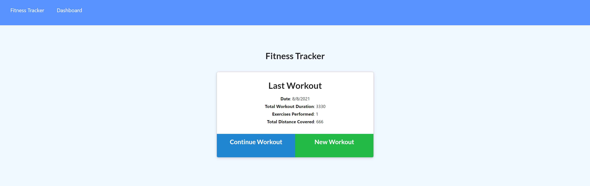
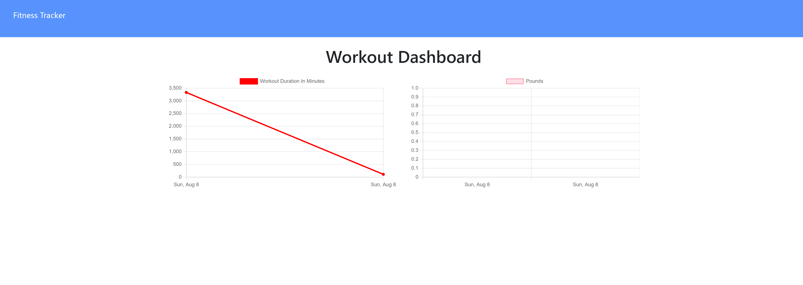

## Fitness Tracker

## Description

This fitness tracker will allow you to keep track of your cardio and weight lifting workouts by storing all your information into a Mongo Database using a Mongoose schema and Express for route handling.

## Table of Contents

- [Usage](#Usage)
- [License](#License)
- [Questions](#Questions)
- [Acknowledgements](#Acknowledgements)
- [Screenshots](#Screenshots)

## Usage

Follow these steps to use the Fitness Tracker:
    
1. Follow ths link to the deployed application: [Fitness Tracker](https://mig-fitness-tracker.herokuapp.com/).
2.  From the `Fitness Tracker` page select `New Workout` or `Continue Workout`, choose either resistance or cardio and follow the prompts.
3.  When you are done click `Complete` and your information will be tallied and displayed on the dashboard.
4.  To view your workout totals click `Dashboard`.

## License

MIT

## Questions

For additional information please contact me via GitHub at [https://github.com/malicea0783](https://github.com/malicea0783) or via email at [malicea0783@gmail.com](mailto:malicea0783@gamil.com?subject=[GitHub]%Employee%Tracker).

## Acknowledgements

Valerie Michalecki: [https://github.com/vmichalecki](https://github.com/vmichalecki)

## Screenshots

